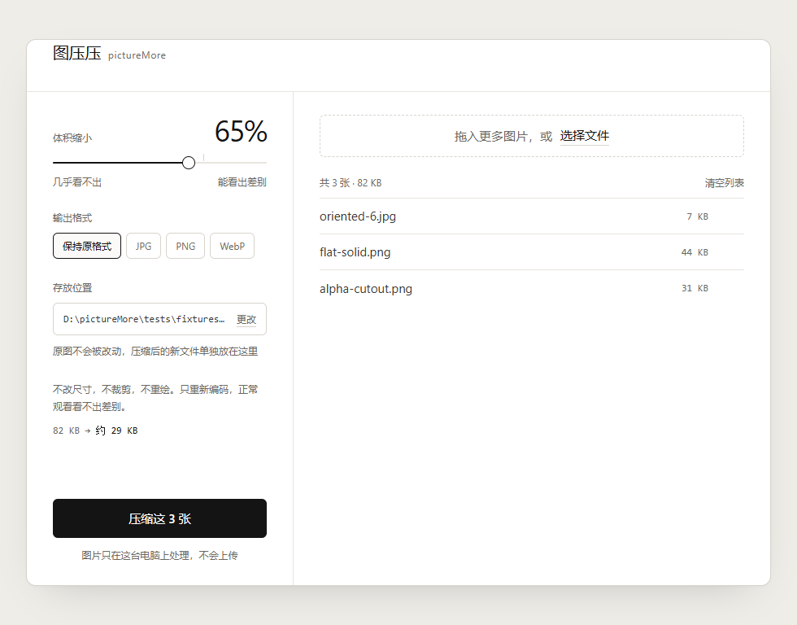

# 图压压 pictureMore

**把「发不出去的图」压到能发出去。** Windows 桌面应用，全程本地运行。



---

## 为什么做这个

场景很具体：微信发不出、邮件附件超限、办事系统要求「照片 ≤ 200KB 且必须 JPG」。

在线压缩工具都能解决这个问题，代价是把图上传到别人的服务器。证件照、合同、私密照片，很多人不愿意。

而这件事其实**不需要联网**。

---

## 两条承诺

### 一、图片内容永不离开你的机器

- 运行时**零网络请求**，断网完全可用
- 无遥测、无埋点、无广告
- 前端资源全部打包，**不用 CDN**（避免断网时界面崩）
- 主进程在运行时也拦截网络请求，不只是「没有调用的地方」

### 二、只改文件大小，不改图片本身

很多压缩工具靠**悄悄降分辨率**兑现压缩率。图在手机上看还行，打印或放大就废了。

本产品承诺**尺寸、构图、像素一律不动**，只做编码层面的优化：

- 绝不缩放、绝不裁剪、绝不旋转像素
- 每次输出后**断言宽高与输入一致**，不一致就抛错、不写文件
- 压缩目标达不成时**如实告诉你**，绝不为了达标牺牲观感

---

## 功能

| 功能 | 说明 |
|---|---|
| **拖拽即用** | 拖入图片或文件夹（展开一层），自动筛选图片文件 |
| **指定缩小比例** | 拖滑块设定想缩小多少，20% 到 90% |
| **输出格式** | 保持原格式 / JPG / PNG / WebP |
| **实时预估** | 拖动滑块即时显示预计体积，纯前端计算 |
| **逐行状态** | 每张图单独显示结果，失败原因直接写在那一行 |
| **绝不覆盖原图** | 默认输出到 `<原图目录>/processed`，同名自动加序号 |
| **单批上限** | 一次最多 100 张，超出部分如实报出 |

界面只有中文。全站零图标、零 emoji，交互靠文字。

---

## 支持的格式

| | 格式 |
|---|---|
| **输入** | HEIC / HEIF、JPG / JPEG、PNG、WebP、AVIF、GIF、TIFF |
| **输出** | JPG、PNG、WebP |

iPhone 拍的 HEIC 直接拖进来就行，不用先转换。

> **PNG 能压多少，看图的色数，不看输入格式。** 截图、图标、线条图（颜色数 ≤ 256）走调色板量化，能压掉 80% 以上；照片类几十万色，无损格式无能为力，此时会返回原文件并如实标注。

---

## 下载使用

到 [Releases](../../releases) 页下载。两种形态：

| 文件 | 说明 |
|---|---|
| `图压压-x.y.z-便携版.exe` | **免安装单文件**，约 114MB。双击就跑，不写注册表，可以拷到 U 盘 |
| `图压压-x.y.z-setup.exe` | 安装包，约 120MB。建桌面与开始菜单快捷方式，可正常卸载 |

便携版每次启动会先自解压到临时目录，比装好的慢一两秒。

---

## 压缩是怎么做的

核心思路：**完全不碰像素，只在「编码质量」这一个旋钮上做搜索。**

1. 算出目标体积：`原体积 × (1 − 缩小百分比)`
2. 先试**质量底线**。如果连底线都压不到目标，说明再往上抬质量只会更大，一次编码就能判定结果
3. 然后在 `[底线, 95]` 上二分搜索，最多试 6 档
4. 从试过的档里挑「**满足目标且质量最高**」的那一个
5. 一个都没达标，退回质量底线并如实标记
6. 结果比原图还大，直接返回原文件

第 2 步不是微优化。实测高熵图（噪声类）的编码次数从 6 次降到 1 次。

质量底线也不是拍脑袋定的：「正常观看看不出差别」是**量化验证过**的。输出解回像素与原图逐点比，均值偏差 < 3/255、p99 ≤ 8。

完整推导、实测数据、以及每一条「为什么不能按直觉写」，见 [`docs/decisions.md`](docs/decisions.md)。

---

## 开发

```bash
npm install
npm run dev              # 开发模式
npm run build            # 类型检查 + 构建 + 打 Windows 安装包

npm run check            # 主护栏：两条 lint + 类型检查 + 全部测试
npm run smoke            # 端到端：构建 + 启动 + 20 组检查 + 5 张截图
npm run smoke:packaged   # 打包产物冒烟
npm run smoke:packaged:cn # 同上，但在中文 + 空格路径下跑
npm run smoke:portable   # 免安装便携版冒烟
npm run check:package    # 核查安装包内容有没有混进不该有的东西
```

技术栈：Electron 44 + React 19 + Vite 8 + TypeScript 5.9 + Tailwind CSS 4 + sharp 0.35 + zustand 5。

**三条不能破的线**（违反任何一条，代码即使跑通也是错的）：

1. 绝不缩放、裁剪、旋转像素
2. 每次输出后断言宽高与输入一致，不一致就抛错不写文件
3. 渲染进程不碰文件系统，`contextIsolation: true` 永远不动

这三条都有自动化护栏守着，不靠人记。

---

## 文档地图

| 文件 | 内容 |
|---|---|
| [`AGENTS.md`](AGENTS.md) | AI 开发会话的入口页：当前状态、三条红线、怎么验证 |
| [`docs/decisions.md`](docs/decisions.md) | **实测结论与取舍记录**，每条都写着「为什么不能按直觉写」 |
| [`SPEC.md`](SPEC.md) | 开发依据：架构、压缩算法、IPC 契约、已知陷阱 |
| [`DESIGN.md`](DESIGN.md) | 视觉规格：三层 token、组件状态矩阵、动效、文案规则 |
| [`prototype/index.html`](prototype/index.html) | 唯一视觉基准，浏览器直接打开 |
| [`PRODUCT.md`](PRODUCT.md) | 产品定位、目标用户、能力边界 |
| [`docs/DEVELOPMENT.md`](docs/DEVELOPMENT.md) | 技术栈决策依据、目录结构、开发环境 |

---

## 许可

尚未指定许可证。在明确之前，保留所有权利。

---

## 关于这份代码

这个项目是**用 AI 辅助开发完成**的，所以代码库里留下了大量「为什么这么做」的记录 —— 尤其是那些**实测推翻了直觉**的地方。`docs/decisions.md` 有一百多条这样的条目，从「sharp 的预编译版解不了 HEIC 的像素」到「一条永远不命中的检查规则比没有检查更危险」。

如果你要接手这份代码，建议先读 `docs/decisions.md`，能省掉一半返工。
